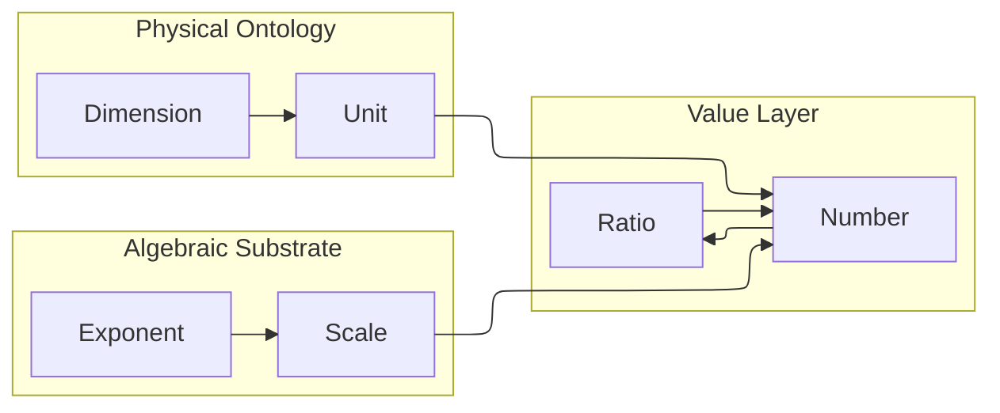

# ucon

> Pronounced: _yoo · cahn_
> A lightweight, **unit-aware computation library** for Python — built on first-principles.

[](https://github.com/withtwoemms/ucon/actions?query=workflow%3Atests)
[](https://codecov.io/gh/withtwoemms/ucon)
[](https://github.com/withtwoemms/ucon/actions?query=workflow%3Apublish)

---

## Overview

`ucon` helps Python understand the *physical meaning* of your numbers.
It combines **units**, **scales**, and **dimensions** into a composable algebra that supports:

- Dimensional analysis through `Number` and `Ratio`
- Scale-aware arithmetic and conversions
- Metric and binary prefixes (`kilo`, `kibi`, `micro`, `mebi`, ect.)
- A clean foundation for physics, chemistry, data modeling, and beyond

Think of it as **`decimal.Decimal` for the physical world** — precise, predictable, and type-safe.

## Introduction

The crux of this tiny library is to provide abstractions that simplify the answering of questions like:

> _"If given two milliliters of bromine (liquid Br<sub>2</sub>), how many grams of bromine does one have?"_

To best answer this question, we turn to an age-old technique ([dimensional analysis](https://en.wikipedia.org/wiki/Dimensional_analysis)) which essentially allows for the solution to be written as a product of ratios. `ucon` comes equipped with some useful primitives:
| Type                          | Defined In                              | Purpose                                                                                             | Typical Use Cases                                                                                                      |
| ----------------------------- | --------------------------------------- | --------------------------------------------------------------------------------------------------- | ---------------------------------------------------------------------------------------------------------------------- |
| **`Vector`**                  | `ucon.dimension`                        | Represents the exponent tuple of a physical quantity’s base dimensions (e.g., T, L, M, I, Θ, J, N). | Internal representation of dimensional algebra; building derived quantities (e.g., area, velocity, force).             |
| **`Dimension`**               | `ucon.dimension`                        | Encapsulates physical dimensions (e.g., length, time, mass) as algebraic combinations of vectors.   | Enforcing dimensional consistency; defining relationships between quantities (e.g., length / time = velocity).         |
| **`Unit`**                    | `ucon.unit`                             | Represents a named, dimensioned measurement unit (e.g., meter, second, joule).                      | Attaching human-readable units to quantities; defining or composing new units (`newton = kilogram * meter / second²`). |
| **`Scale`**                   | `ucon.core`                             | Encodes powers of base magnitudes (binary or decimal prefixes like kilo-, milli-, mebi-).           | Adjusting numeric scale without changing dimension (e.g., kilometer ↔ meter, byte ↔ kibibyte).                         |
| **`Exponent`**                | `ucon.core`                             | Represents base-power pairs (e.g., 10³, 2¹⁰) used by `Scale`.                                       | Performing arithmetic on powers and bases; normalizing scales across conversions.                                      |
| **`Number`**                  | `ucon.core`                             | Combines a numeric quantity with a unit and scale; the primary measurable type.                     | Performing arithmetic with units; converting between compatible units; representing physical quantities like 5 m/s.    |
| **`Ratio`**                   | `ucon.core`                             | Represents the division of two `Number` objects; captures relationships between quantities.         | Expressing rates, densities, efficiencies (e.g., energy / time = power, length / time = velocity).                     |
| **`units` module**            | `ucon.units`                            | Defines canonical unit instances (SI and common derived units).                                     | Quick access to standard physical units (`units.meter`, `units.second`, `units.newton`, etc.).                               |                                                   |

### Under the Hood

`ucon` models unit math through a hierarchy where each layer builds on the last:



## Why `ucon`?

Python already has mature libraries for handling units and physical quantities — Pint, SymPy, and Unum — each solving part of the same problem from different angles:

| Library   | Focus                                                   | Limitation                                                                                                             |
| --------- | ------------------------------------------------------- | ---------------------------------------------------------------------------------------------------------------------- |
| **Pint**  | Runtime unit conversion and compatibility checking      | Treats quantities as decorated numbers — conversions work, but the algebra behind them isn’t inspectable or type-safe. |
| **SymPy** | Symbolic algebra and simplification of unit expressions | Excellent for symbolic reasoning, but not designed for runtime validation, conversion, or serialization.               |
| **Unum**  | Unit-aware arithmetic and unit propagation              | Tracks units through arithmetic but lacks explicit dimensional algebra, conversion taxonomy, or runtime introspection. |

Together, these tools can _use_ units, but none can explicitly represent and verify the relationships between units and dimensions.

That’s the gap `ucon` fills.

It treats units, dimensions, and scales as first-class objects and builds a composable algebra around them.
This allows you to:
- Represent dimensional meaning explicitly (`Dimension`, `Vector`);
- Compose and compute with type-safe, introspectable quantities (`Unit`, `Number`);
- Perform reversible, declarative conversions (standard, linear, affine, nonlinear);
- Serialize and validate measurements with Pydantic integration;
- Extend the system with custom unit registries and conversion families.

Where Pint, Unum, and SymPy focus on _how_ to compute with units,
`ucon` focuses on why those computations make sense. Every operation checks the dimensional structure, _not just the unit labels_. This means ucon doesn’t just track names: it enforces physics:
```python
from ucon import Number, units

length = Number(quantity=5, unit=units.meter)
time = Number(quantity=2, unit=units.second)

speed = length / time     # ✅ valid: L / T = velocity
invalid = length + time   # ❌ raises: incompatible dimensions
```

## Setup

Simple:
```bash
pip install ucon
```

## Usage

This sort of dimensional analysis:
```
 2 mL bromine | 3.119 g bromine
--------------x-----------------  #=> 6.238 g bromine
      1       |  1 mL bromine
```
becomes straightforward when you define a measurement:
```python
from ucon import Number, Scale, Units, Ratio

# Two milliliters of bromine
two_mL_bromine = Number(unit=Units.liter, scale=Scale.milli, quantity=2)

# Density of bromine: 3.119 g/mL
bromine_density = Ratio(
    numerator=Number(unit=Units.gram, quantity=3.119),
    denominator=Number(unit=Units.liter, scale=Scale.milli),
)

# Multiply to find mass
grams_bromine = two_mL_bromine * bromine_density
print(grams_bromine)  # <6.238 gram>
```

Scale conversion is automatic and precise:

```python
grams_bromine.to(Scale.milli)  # <6238.0 milligram>
grams_bromine.to(Scale.kibi)   # <0.006091796875 kibigram>
```

---

## Roadmap Highlights

| Version | Theme | Focus |
|----------|-------|--------|
| [**0.3.x**](https://github.com/withtwoemms/ucon/milestone/1) | Primitive Type Refinement | Unified algebraic foundation |
| [**0.4.x**](https://github.com/withtwoemms/ucon/milestone/2) | Conversion System | Linear & affine conversions |
| [**0.6.x**](https://github.com/withtwoemms/ucon/milestone/4) | Nonlinear / Specialized Units | Decibel, Percent, pH |
| [**0.8.x**](https://github.com/withtwoemms/ucon/milestone/6) | Pydantic Integration | Type-safe quantity validation |

See full roadmap: [ROADMAP.md](./ROADMAP.md)

---

## Contributing

Contributions, issues, and pull requests are welcome!
Ensure `nox` is installed.
```
pip install -r requirements.txt
```
Then run the full test suite (agains all supported python versions) before committing:

```bash
nox -s test
```
---

> “If it can be measured, it can be represented.
If it can be represented, it can be validated.
If it can be validated, it can be trusted.”
