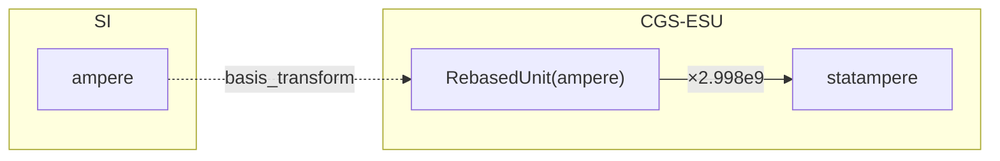

# ConversionGraph Internals

How ucon finds and composes conversion paths between units.

---

## Overview

`ConversionGraph` is a registry of conversion morphisms (Maps) between units. When you call `number.to(target)`, the graph finds a path and composes the Maps along that path.

```python
from ucon.graph import get_default_graph

graph = get_default_graph()
# ~90 edges across ~15 dimension partitions
```

---

## Graph Topology

### Dimension Partitioning

Edges between `Unit` nodes are partitioned by `Dimension`. This enables O(1) lookup to the relevant subgraph and prevents cross-dimension path searches.

```python
_unit_edges: dict[Dimension, dict[Unit, dict[Unit, Map]]]

# Structure:
# {
#   Dimension.length: {
#     meter: {foot: LinearMap(3.28084), ...},
#     foot: {meter: LinearMap(0.3048), inch: LinearMap(12), ...},
#   },
#   Dimension.mass: {...},
#   ...
# }
```

### Product Edges

For composite units like `joule → watt_hour`, edges exist between `UnitProduct` nodes:

```python
_product_edges: dict[tuple, dict[tuple, Map]]

# Keys are frozen factor representations for hashing
# Example: BTU/hour → watt edge
```

### Rebased Units

Cross-basis conversions (e.g., CGS → SI) use `RebasedUnit` as intermediate nodes:

```python
_rebased: dict[Unit, RebasedUnit]

# Original unit → unit rebased into destination's dimension partition
```

### BasisGraph Reference

For cross-basis validation, ConversionGraph can hold a reference to a `BasisGraph`:

```python
_basis_graph: BasisGraph | None

# When set, validates that cross-basis edges connect compatible bases
```

See [Dual-Graph Architecture](dual-graph-architecture.md) for how these two graphs interact.

---

## BFS Path Finding

### Why BFS?

ucon uses breadth-first search, not Dijkstra, DFS, or A*:

| Algorithm | Why Not |
|-----------|---------|
| Dijkstra | All edges have equal "cost" — there's no weight to minimize |
| DFS | Would find *a* path, not necessarily the shortest |
| A* | No useful heuristic for unit conversion distances |

BFS guarantees the shortest path (fewest hops), which is desirable for numerical stability — fewer composed Maps means less floating-point accumulation.

### The Visited Dict's Dual Role

The `visited` dictionary serves two purposes:

1. **Cycle prevention** — Don't revisit nodes
2. **Path accumulation** — Store the composed Map to reach each node

```python
def _bfs_convert(self, *, start, target, dim: Dimension) -> Map:
    # visited[unit] = composed Map from start to unit
    visited: dict = {start: LinearMap.identity()}
    queue = deque([start])

    while queue:
        current = queue.popleft()
        current_map = visited[current]

        for neighbor, edge_map in self._unit_edges[dim][current].items():
            if neighbor in visited:
                continue

            # Compose: edge_map @ current_map = start → neighbor
            composed = edge_map @ current_map
            visited[neighbor] = composed

            if neighbor == target:
                return composed

            queue.append(neighbor)

    raise ConversionNotFound(f"No path from {start} to {target}")
```

### Composition Order

Maps compose right-to-left (like matrix multiplication):

```python
# Path: meter → foot → inch
# foot_to_inch @ meter_to_foot means:
#   apply meter_to_foot first, then foot_to_inch
```

---

## Conversion Strategies

### 1. Direct Edge Lookup

If a direct edge exists, return it immediately:

```python
if self._has_direct_unit_edge(src=src, dst=dst):
    return self._get_direct_unit_edge(src=src, dst=dst)
```

### 2. BFS in Same Dimension

For units in the same dimension without a direct edge:

```python
return self._bfs_convert(start=src, target=dst, dim=src.dimension)
```

### 3. Factorwise Decomposition

For `UnitProduct` conversions where factor structures align:

```python
# m/s → km/h
# Decompose: convert m→km, convert s→h, combine
```

The algorithm groups factors by effective dimensional vector:

```python
# volume¹ (vector = L³) matches length³ (vector = L¹ × 3 = L³)
effective_vec = dim.vector * exponent
```

### 4. Product Edge Lookup

For composite units that don't decompose cleanly:

```python
# BTU/h → W requires a direct product edge
# (energy/time structures differ: BTU vs J, h vs s)
graph.add_edge(src=units.btu / units.hour, dst=units.watt, map=LinearMap(0.29307))
```

### 5. Cross-Basis Conversion

For units from different dimensional bases (e.g., SI → CGS-ESU):

```python
graph.add_edge(
    src=units.ampere,           # SI basis
    dst=statampere,             # CGS-ESU basis
    map=LinearMap(2.998e9),
    basis_transform=SI_TO_CGS_ESU,  # validates dimensional compatibility
)
```

The `basis_transform` parameter triggers cross-basis handling:

1. **Validate** — `SI_TO_CGS_ESU(ampere.dimension.vector) == statampere.dimension.vector`
2. **Create RebasedUnit** — wraps `ampere` in the CGS-ESU dimension partition
3. **Store edge** — `RebasedUnit(ampere) ↔ statampere`



When `_basis_graph` is set, `convert()` also validates that bases are connected before searching:

```python
if self._basis_graph is not None:
    if not self._basis_graph.are_connected(src.basis, dst.basis):
        raise NoTransformPath(src.basis, dst.basis)
```

---

## Map Types

### LinearMap

For proportional conversions:

```python
class LinearMap:
    a: float  # y = a * x

    def __call__(self, x): return self.a * x
    def inverse(self): return LinearMap(1 / self.a)
    def derivative(self, x): return self.a
```

**Examples:** meter↔foot, gram↔pound, joule↔calorie

### AffineMap

For offset conversions (temperature):

```python
class AffineMap:
    a: float  # scale
    b: float  # offset
    # y = a * x + b

    def __call__(self, x): return self.a * x + self.b
    def inverse(self): return AffineMap(1/self.a, -self.b/self.a)
    def derivative(self, x): return self.a
```

**Examples:** celsius↔kelvin (`K = C + 273.15`), fahrenheit↔celsius

### LogMap / ExpMap

For logarithmic scales:

```python
class LogMap:
    scale: float = 1.0
    base: float = 10.0
    offset: float = 0.0
    # y = scale * log_base(x) + offset
```

**Examples:** fraction↔nines (`-log₁₀(1 - x)`)

### ComposedMap

Generic fallback for heterogeneous composition:

```python
class ComposedMap:
    outer: Map
    inner: Map
    # y = outer(inner(x))
```

---

## Edge Addition

### Automatic Inverse

Adding an edge automatically registers the inverse:

```python
def _add_unit_edge(self, *, src: Unit, dst: Unit, map: Map) -> None:
    self._unit_edges[dim][src][dst] = map
    self._unit_edges[dim][dst][src] = map.inverse()
```

### Cyclic Consistency Check

If the reverse edge already exists, the round-trip must be identity:

```python
if self._has_direct_unit_edge(src=dst, dst=src):
    existing = self._get_direct_unit_edge(src=dst, dst=src)
    roundtrip = existing @ map
    if not roundtrip.is_identity():
        raise CyclicInconsistency(f"Inconsistent: {src}→{dst}→{src}")
```

This catches contradictory conversion factors during graph construction.

### Cross-Basis Edge with BasisTransform

For edges between units in different bases, pass `basis_transform`:

```python
from ucon.bases import SI_TO_CGS_ESU

graph.add_edge(
    src=units.ampere,
    dst=statampere,
    map=LinearMap(2.998e9),
    basis_transform=SI_TO_CGS_ESU,
)
```

The transform is used to:

1. **Validate** that the source dimension maps to the destination dimension
2. **Create a RebasedUnit** linking the source into the destination's partition
3. **Store the transform** for introspection via `list_transforms()`

### Bulk Cross-Basis Registration

Use `connect_systems()` to register multiple cross-basis edges:

```python
graph.connect_systems(
    basis_transform=SI_TO_CGS,
    edges={
        (units.meter, centimeter_cgs): LinearMap(100),
        (units.gram, gram_cgs): LinearMap(1),
        (units.second, second_cgs): LinearMap(1),
    },
)
```

---

## No Caching (Currently)

The graph does not cache conversion paths. Each `number.to(target)` runs BFS.

**Why:**

1. Most dimension partitions are small (<10 nodes) — BFS is fast
2. Caching adds complexity for marginal gain
3. Custom graphs via `using_graph()` would invalidate caches

**When this might change:**

- v0.10.x NumPy integration may add path caching for batch conversions
- Profiling shows BFS as a bottleneck in real workloads

---

## Graph-Local Name Resolution

Since v0.7.3, unit name resolution is graph-scoped:

```python
# Each graph has its own registries
_name_registry: dict[str, Unit]      # case-insensitive
_name_registry_cs: dict[str, Unit]   # case-sensitive (m vs M)

# using_graph() sets both conversion AND parsing context
with using_graph(custom_graph):
    unit = get_unit_by_name("custom_unit")  # resolves in custom_graph
```

This enables domain-specific units without polluting the global namespace.

---

## Unit Compatibility

### Unit.basis Property

Each unit exposes its dimensional basis:

```python
>>> units.meter.basis
Basis('SI', ['T', 'L', 'M', 'I', 'Θ', 'J', 'N', 'B'])

>>> statampere.basis
Basis('CGS-ESU', ['L', 'M', 'T', 'Q'])
```

### Unit.is_compatible()

Check if two units can be converted:

```python
def is_compatible(self, other: Unit, basis_graph: BasisGraph | None = None) -> bool:
    """
    Returns True if:
    1. Same dimension (same basis), OR
    2. Bases are connected via basis_graph (cross-basis)
    """
```

**Examples:**

```python
# Same dimension — always compatible
units.meter.is_compatible(units.foot)  # True

# Different dimensions — incompatible
units.meter.is_compatible(units.second)  # False

# Cross-basis — depends on BasisGraph connectivity
from ucon.bases import SI_TO_CGS_ESU
bg = BasisGraph().with_transform(SI_TO_CGS_ESU)

units.ampere.is_compatible(statampere, basis_graph=bg)  # True
```

---

## Default Graph Contents

The standard graph includes ~90 edges:

| Dimension | Units | Example Edges |
|-----------|-------|---------------|
| length | meter, foot, inch, yard, mile | m↔ft, ft↔in, mi↔ft |
| mass | gram, kilogram, pound, ounce | kg↔g, kg↔lb, lb↔oz |
| time | second, minute, hour, day | s↔min, min↔h, h↔d |
| temperature | kelvin, celsius, fahrenheit, rankine | C↔K (affine), F↔C (affine) |
| pressure | pascal, bar, psi, atm, torr, mmHg, inHg | Pa↔bar, atm↔Pa |
| force | newton, pound_force, kilogram_force, dyne | lbf↔N, kgf↔N |
| volume | liter, gallon | L↔gal, L↔m³ |
| energy | joule, calorie, btu, watt_hour | J↔cal, J↔BTU, J↔Wh |
| power | watt, horsepower | W↔hp, BTU/h↔W |
| information | bit, byte | B↔b |
| angle | radian, degree, arcminute, arcsecond, turn, gradian | rad↔deg, deg↔arcmin |
| solid_angle | steradian, square_degree | sr↔sq_deg |
| ratio | fraction, percent, permille, ppm, ppb, basis_point, nines | frac↔%, frac↔ppm |
