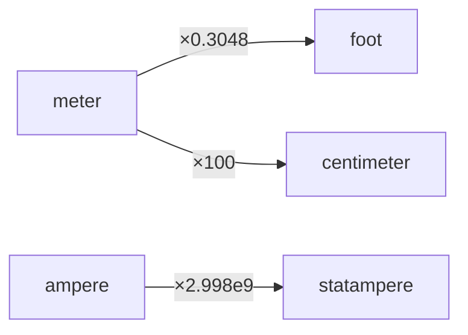
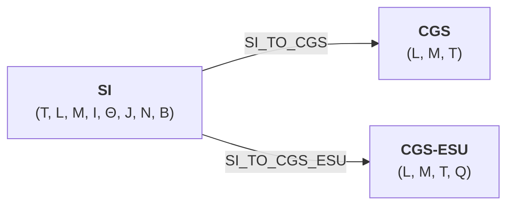
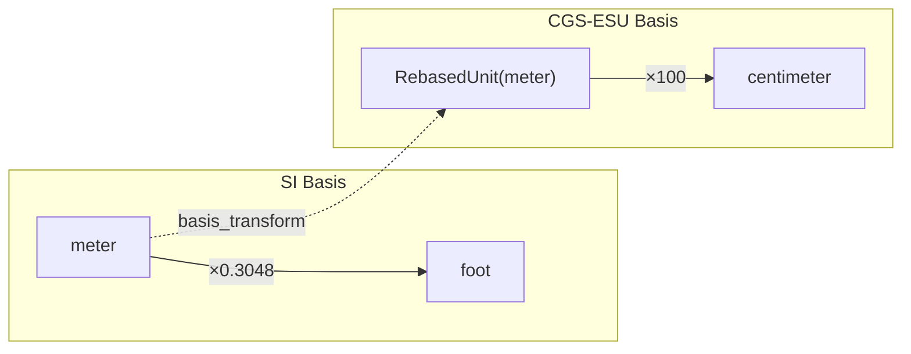
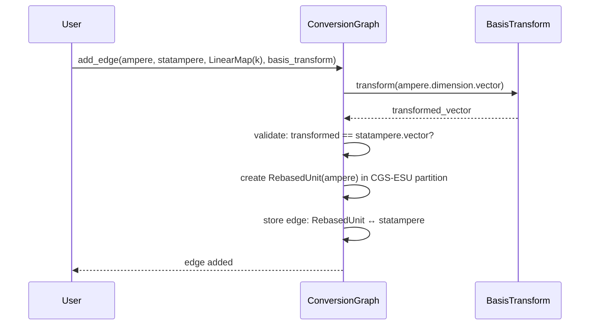
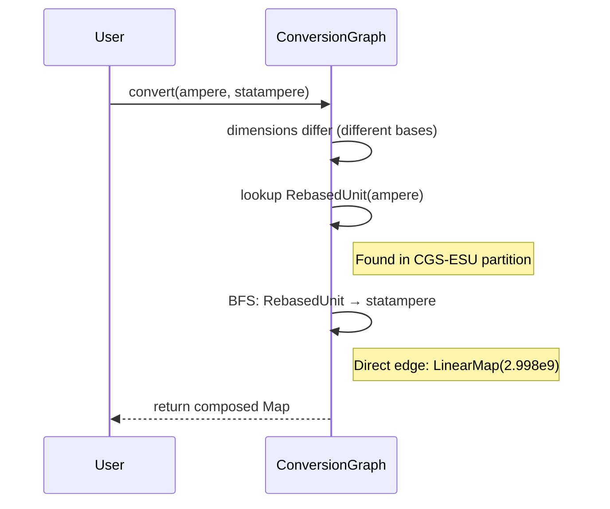
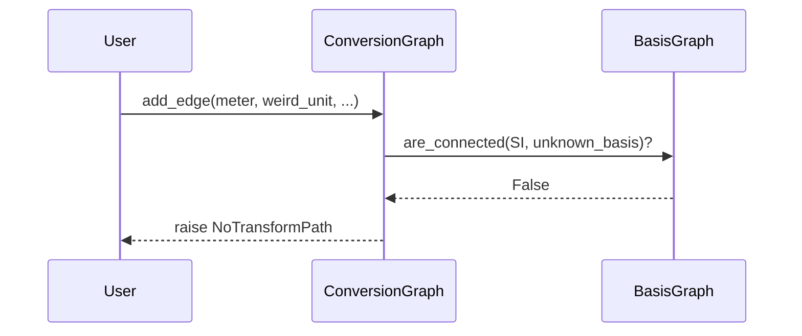
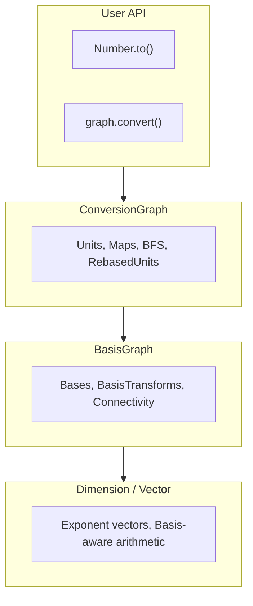

# Dual-Graph Architecture

ucon uses two complementary graph structures to handle unit conversions:

| Graph | Domain | Nodes | Edges | Purpose |
|-------|--------|-------|-------|---------|
| **BasisGraph** | Dimensional | `Basis` | `BasisTransform` | Validates cross-basis compatibility |
| **ConversionGraph** | Numeric | `Unit` | `Map` (LinearMap, AffineMap) | Executes conversions with scaling factors |

This separation reflects a fundamental distinction: *dimensional compatibility* is a structural property independent of *numeric conversion factors*.

---

## Why Two Graphs?

### The Problem with a Single Graph

A naive approach stores all conversions in one graph:



This works for same-basis conversions but fails for cross-basis cases:

1. **Dimensional validation** — How do we know `ampere → statampere` is valid? In SI, current has dimension `I`. In CGS-ESU, it has dimension `L^(3/2) M^(1/2) T^(-2)`. A single graph can't express that these are "the same" dimension in different bases.

2. **Basis connectivity** — If we add `meter → centimeter_cgs`, can we also convert `newton → dyne`? The answer depends on whether SI and CGS bases are connected — information a unit-level graph doesn't capture.

3. **Lossy projections** — CGS can't represent temperature. Should `kelvin → ???` fail at edge-addition time or conversion time? We need basis-level knowledge to decide.

### The Solution: Separation of Concerns

**BasisGraph** answers: *"Can dimensions from basis A be expressed in basis B?"*

**ConversionGraph** answers: *"What numeric factor converts unit X to unit Y?"*

---

## BasisGraph: The Dimensional Layer



### Structure

- **Nodes**: `Basis` objects (SI, CGS, CGS_ESU)
- **Edges**: `BasisTransform` matrices

### BasisTransform

A `BasisTransform` is a matrix mapping dimension vectors between bases:

```
SI_TO_CGS_ESU:
           L      M      T      Q
    T      .      .      1      .    # time maps 1:1
    L      1      .      .      .    # length maps 1:1
    M      .      1      .      .    # mass maps 1:1
    I    3/2    1/2     -2      .    # current becomes derived!
    Θ      .      .      .      .    # temperature: not representable
    ...
```

Row 4 shows the key insight: SI current (`I^1`) transforms to CGS-ESU as `L^(3/2) M^(1/2) T^(-2)`. This is a *dimensional* relationship, independent of the numeric factor (2.998×10⁹).

### Operations

```python
from ucon.basis import BasisGraph, BasisTransform
from ucon.bases import SI, CGS_ESU, SI_TO_CGS_ESU

bg = BasisGraph()
bg = bg.with_transform(SI_TO_CGS_ESU)

# Check connectivity
bg.are_connected(SI, CGS_ESU)  # True

# Transform a dimension vector
si_current = units.ampere.dimension.vector
cgs_current = SI_TO_CGS_ESU(si_current)  # L^(3/2) M^(1/2) T^(-2)
```

---

## ConversionGraph: The Numeric Layer



### Structure

- **Nodes**: `Unit` objects (meter, foot, ampere, etc.)
- **Edges**: `Map` objects (LinearMap, AffineMap, LogMap)

### Partitioning by Dimension

Edges are partitioned by `Dimension`. Within a partition, BFS finds conversion paths:

```python
# Same-basis: direct BFS
graph.convert(units.meter, units.foot)  # finds path via shared edges

# Cross-basis: requires RebasedUnit bridge
graph.convert(units.ampere, statampere)  # ampere → RebasedUnit → statampere
```

### RebasedUnit: The Bridge

When you add a cross-basis edge, ConversionGraph creates a `RebasedUnit`:

```python
graph.add_edge(
    src=units.ampere,      # SI unit
    dst=statampere,        # CGS-ESU unit
    map=LinearMap(2.998e9),
    basis_transform=SI_TO_CGS_ESU,
)
```

Internally:

1. Validate: `SI_TO_CGS_ESU(ampere.dimension.vector) == statampere.dimension.vector`
2. Create: `RebasedUnit(original=ampere, rebased_dimension=cgs_esu_current, transform=SI_TO_CGS_ESU)`
3. Store edge: `RebasedUnit → statampere` with `LinearMap(2.998e9)`

The `RebasedUnit` lives in the *destination's* dimension partition, enabling BFS to find paths across bases.

---

## Interaction Flow

### Adding a Cross-Basis Edge



### Converting Across Bases



### Validating with BasisGraph

When `_basis_graph` is set on ConversionGraph:



---

## Design Rationale

### Why Not Merge Them?

1. **Different lifetimes** — BasisGraph is typically static (standard physics). ConversionGraph grows as users add domain units.

2. **Different semantics** — BasisTransform is *algebraic* (matrix multiplication). Map is *numeric* (function application).

3. **Validation vs. execution** — BasisGraph catches structural errors early. ConversionGraph handles runtime computation.

4. **Composability** — Multiple ConversionGraphs can share one BasisGraph. Domain-specific graphs (aerospace, medical) inherit basis connectivity.

### The Layered View



Each layer has a single responsibility:

- **Dimension/Vector**: Represent dimensional quantities
- **BasisGraph**: Validate structural compatibility
- **ConversionGraph**: Execute numeric conversions
- **User API**: Convenient access to conversions

---

## Example: Full Cross-Basis Flow

```python
from ucon import units, Dimension
from ucon.basis import BasisGraph, Vector
from ucon.bases import SI, CGS_ESU, SI_TO_CGS_ESU
from ucon.core import Unit
from ucon.graph import ConversionGraph
from ucon.maps import LinearMap

# 1. Set up BasisGraph
basis_graph = BasisGraph().with_transform(SI_TO_CGS_ESU)

# 2. Create CGS-ESU unit
cgs_current_dim = Dimension(
    vector=Vector(CGS_ESU, (Fraction(3,2), Fraction(1,2), Fraction(-2), Fraction(0))),
    name="cgs_current",
)
statampere = Unit(name="statampere", dimension=cgs_current_dim)

# 3. Create ConversionGraph with BasisGraph
graph = ConversionGraph()
graph._basis_graph = basis_graph

# 4. Add cross-basis edge (validated by both graphs)
graph.add_edge(
    src=units.ampere,
    dst=statampere,
    map=LinearMap(2.998e9),
    basis_transform=SI_TO_CGS_ESU,
)

# 5. Convert (BFS finds path via RebasedUnit)
result = graph.convert(units.ampere, statampere)
print(result(1))  # 2.998e9
```

---

## Summary

| Concern | BasisGraph | ConversionGraph |
|---------|------------|-----------------|
| Question answered | "Are these bases compatible?" | "What's the numeric factor?" |
| Node type | Basis | Unit |
| Edge type | BasisTransform (matrix) | Map (function) |
| Validation | Dimensional structure | Dimension equality |
| When used | Edge addition, compatibility checks | Path finding, conversion execution |

The dual-graph architecture cleanly separates *what can be converted* (BasisGraph) from *how to convert it* (ConversionGraph), enabling robust cross-basis unit handling while maintaining single-basis simplicity for common cases.
