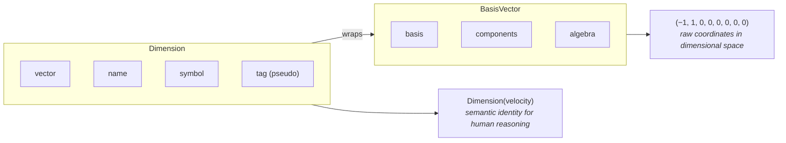
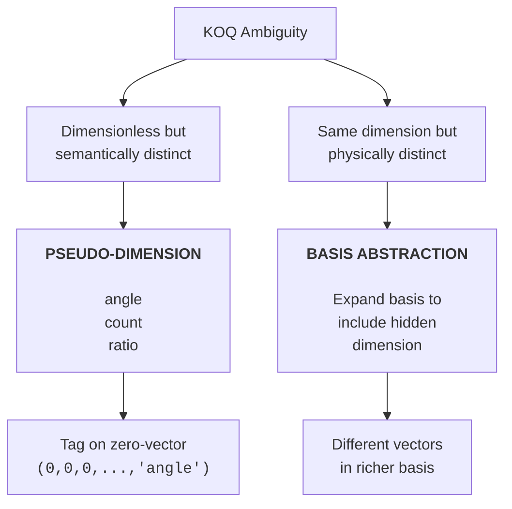

# The Kind-of-Quantity Problem

Core conceptual foundation for understanding dimensional ambiguity and how ucon addresses it.

---

## The Problem

When working with physical quantities, a fundamental limitation of dimensional
analysis becomes apparent: **units and dimensions do not uniquely identify
the kind of quantity being measured.**

### Examples of Ambiguity

| Unit | Possible Quantities |
|------|---------------------|
| `kg·m²·s⁻²` | Energy, Torque, Work, Heat |
| `s⁻¹` | Frequency, Angular velocity, Radioactive activity |
| `1` (dimensionless) | Angle, Refractive index, Efficiency, Count |

This is known as the **Kind-of-Quantity (KOQ) problem** in metrology literature.

### Why It Matters

- **Silent errors**: Adding energy to torque produces nonsense but passes dimensional checks
- **Ambiguous conversions**: `s⁻¹ → Hz` is valid for frequency but not for activity
- **Lost semantics**: Dimensionless quantities lose all physical meaning

---

## ucon's Two Solutions

ucon addresses KOQ through two complementary mechanisms:

1. **Pseudo-dimensions** — Semantic tags for quantities dimensionless within a basis
2. **Basis abstraction** — Coordinate transforms across dimensional systems

Both solutions build on the relationship between `BasisVector` and `Dimension`.

---

## BasisVector and Dimension

Before diving into solutions, it's important to understand how ucon represents
dimensions internally.

### BasisVector: The Coordinate Representation

A `BasisVector` is the raw numerical representation of a dimension—a tuple of
exponents over a basis. Think of it as coordinates in dimensional space:

```python
from ucon import BasisVector, SI
from fractions import Fraction

# Velocity = L/T = L¹·T⁻¹ in SI
# SI order: (T, L, M, I, Θ, J, N, B)
velocity_vector = BasisVector(SI, (
    Fraction(-1),  # T⁻¹
    Fraction(1),   # L¹
    Fraction(0),   # M⁰
    Fraction(0),   # I⁰
    Fraction(0),   # Θ⁰
    Fraction(0),   # J⁰
    Fraction(0),   # N⁰
    Fraction(0),   # B⁰
))

velocity_vector.is_dimensionless()  # False
```

`BasisVector` supports algebraic operations (multiplication, division, exponentiation)
that add, subtract, or scale exponents:

```python
# length_vec * length_vec = area_vec (exponents add)
# length_vec / time_vec = velocity_vec (exponents subtract)
```

### Dimension: The Named, Semantic Wrapper

A `Dimension` wraps a `BasisVector` with additional metadata:

- **name**: Human-readable identifier (e.g., "velocity", "energy")
- **symbol**: Short notation (e.g., "L", "T")
- **tag**: For pseudo-dimensions (e.g., "angle", "count")

```python
from ucon import Dimension

# Access predefined dimensions
Dimension.velocity.name    # "velocity"
Dimension.velocity.vector  # The underlying BasisVector

# Dimensions resolve from vectors automatically
from ucon import resolve_dimension
resolved = resolve_dimension(velocity_vector)
resolved == Dimension.velocity  # True
```

### The Key Relationship



**Why does this matter for KOQ?**

- `BasisVector` handles the algebra—it knows nothing about "torque" vs "energy"
- `Dimension` provides the semantic layer—it can distinguish quantities via names or tags
- The KOQ problem arises when the same `BasisVector` maps to multiple physical meanings
- ucon's solutions work by either:
  - Adding a **tag** to the `Dimension` (pseudo-dimensions)
  - Choosing a different **basis** so the `BasisVector` differs (basis abstraction)

---

## Solution 1: Pseudo-Dimensions

For quantities that are mathematically dimensionless but physically distinct,
ucon provides **pseudo-dimensions**:

```python
from ucon import Dimension, units

# These are all dimensionless (zero vector) but semantically isolated
Dimension.angle       # radians, degrees
Dimension.solid_angle # steradians
Dimension.ratio       # percent, ppm, ppb
Dimension.count       # discrete items

# Semantic isolation prevents nonsensical operations
angle = units.radian(3.14)
count = units.each(5)

# This raises TypeError — incompatible pseudo-dimensions
result = angle + count  # Error!

# But algebra within the same pseudo-dimension works
total_angle = units.radian(1.57) + units.radian(1.57)  # OK
```

### How Pseudo-Dimensions Work

| Aspect | Behavior |
|--------|----------|
| Algebraic | Zero vector — behaves as dimensionless in multiplication |
| Semantic | Tagged — prevents mixing incompatible types |
| Cancellation | `angle / angle = dimensionless` (not angle) |

### When to Use

- Angles (radian, degree, steradian)
- Counts of discrete items
- Ratios and proportions (percent, ppm)
- Any quantity dimensionless in all reasonable unit systems

---

## Solution 2: Basis Abstraction

The key insight is that **dimensional ambiguity is basis-dependent**. Two quantities
that share the same dimension in one basis may be distinguished in another.

### Example: Torque vs Energy

In standard SI, torque and energy are dimensionally identical:

| Quantity | SI Dimension | Problem |
|----------|--------------|---------|
| Energy | M·L²·T⁻² | Same as torque! |
| Torque | M·L²·T⁻² | Same as energy! |

But physically, torque = force × lever arm × **angle**. If we choose a basis where
angle is NOT dimensionless, the ambiguity resolves:

```python
from ucon import Basis, BasisComponent, BasisVector
from fractions import Fraction

# Define a basis where angle (θ) is a base dimension
MECHANICAL_WITH_ANGLE = Basis(
    "mechanical_angle",
    [
        BasisComponent("time", "T"),
        BasisComponent("length", "L"),
        BasisComponent("mass", "M"),
        BasisComponent("angle", "θ"),  # Angle as base dimension!
    ],
)

# In this basis:
# Energy = M·L²·T⁻²·θ⁰  (no angle dependence)
# Torque = M·L²·T⁻²·θ¹  (depends on angle!)

energy_vec = BasisVector(MECHANICAL_WITH_ANGLE, (
    Fraction(-2), Fraction(2), Fraction(1), Fraction(0)  # T⁻² L² M¹ θ⁰
))

torque_vec = BasisVector(MECHANICAL_WITH_ANGLE, (
    Fraction(-2), Fraction(2), Fraction(1), Fraction(1)  # T⁻² L² M¹ θ¹
))

energy_vec == torque_vec  # False! Now distinguishable
```

### Example: Gray (Gy) vs Sievert (Sv)

In radiation dosimetry, absorbed dose (Gy) and dose equivalent (Sv) have the
same SI dimension (m²·s⁻²) but measure different things:

- **Gray**: Physical energy absorbed per unit mass
- **Sievert**: Biological effect (weighted by radiation type)

A domain-specific basis can distinguish them:

```python
from ucon import Basis, BasisComponent, BasisVector
from fractions import Fraction

DOSIMETRY = Basis(
    "dosimetry",
    [
        BasisComponent("time", "T"),
        BasisComponent("length", "L"),
        BasisComponent("mass", "M"),
        BasisComponent("biological_weight", "Q"),  # Quality factor dimension
    ],
)

# Absorbed dose (Gy): L²·T⁻²·Q⁰
# Dose equivalent (Sv): L²·T⁻²·Q¹

absorbed_dose = BasisVector(DOSIMETRY, (
    Fraction(-2), Fraction(2), Fraction(0), Fraction(0)
))

dose_equivalent = BasisVector(DOSIMETRY, (
    Fraction(-2), Fraction(2), Fraction(0), Fraction(1)  # Q¹ factor!
))

# Now they're dimensionally distinct
absorbed_dose == dose_equivalent  # False
```

### Natural Units (Advanced)

For particle physics, where c = ℏ = k_B = 1, dimensions collapse further:

| Quantity | SI Dimension | Natural Units |
|----------|--------------|---------------|
| Velocity | L·T⁻¹ | E⁰ (dimensionless!) |
| Length | L | E⁻¹ |
| Mass | M | E |

```python
from ucon import SI, NATURAL, SI_TO_NATURAL, BasisVector
from fractions import Fraction

# Velocity becomes dimensionless in natural units
si_velocity = BasisVector(SI, (
    Fraction(-1), Fraction(1), Fraction(0), Fraction(0),
    Fraction(0), Fraction(0), Fraction(0), Fraction(0),
))

natural_velocity = SI_TO_NATURAL(si_velocity)
natural_velocity.is_dimensionless()  # True! (c = 1)
```

### When to Use Basis Abstraction

| Scenario | Basis Strategy |
|----------|----------------|
| Torque vs Energy | Add angle as base dimension |
| Gy vs Sv | Add biological weighting dimension |
| SI ↔ CGS | Standard basis transforms |
| Particle physics | Natural units (E only) |
| Electromagnetism | CGS-ESU (charge as base) |

---

## Comparing the Two Approaches

| Aspect | Pseudo-Dimensions | Basis Abstraction |
|--------|-------------------|-------------------|
| **Problem solved** | Dimensionless quantities that differ semantically | Quantities with same dimension that differ physically |
| **Mechanism** | Semantic tag on zero-vector | Choose a basis where dimensions differ |
| **Scope** | Works within any single basis | Requires defining/choosing appropriate basis |
| **Examples** | angle vs count vs ratio | torque vs energy, Gy vs Sv |
| **Declaration** | `Dimension.pseudo("tag")` | `Basis(name, components)` |
| **Trade-off** | Simple but limited to "truly" dimensionless | Powerful but requires domain modeling |

---

## The Unified Picture

Both solutions preserve **kind-of-quantity information** that pure dimensional
analysis loses. The choice depends on the nature of the ambiguity:



**Key insight**: The SI's 7-dimensional basis is a pragmatic choice, not a
physical necessity. Some KOQ problems arise because the SI basis is too
coarse to distinguish certain quantities. ucon lets you:

1. **Add semantic tags** for quantities the SI treats as dimensionless
2. **Define richer bases** for quantities the SI conflates

---

## Further Reading

- Hall, B.D. (2022). "Representing quantities and units in digital systems." *Measurement: Sensors*
- Hall, B.D. (2023). "Modelling expressions of physical quantities." *IC3K 2023*
- Hall, B.D. (2025). "Interpreting SI notation for units and dimensions." *Measurement: Sensors*
