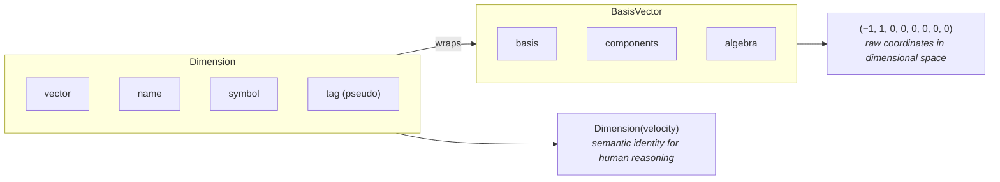
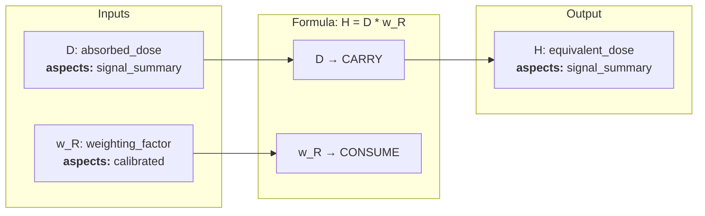
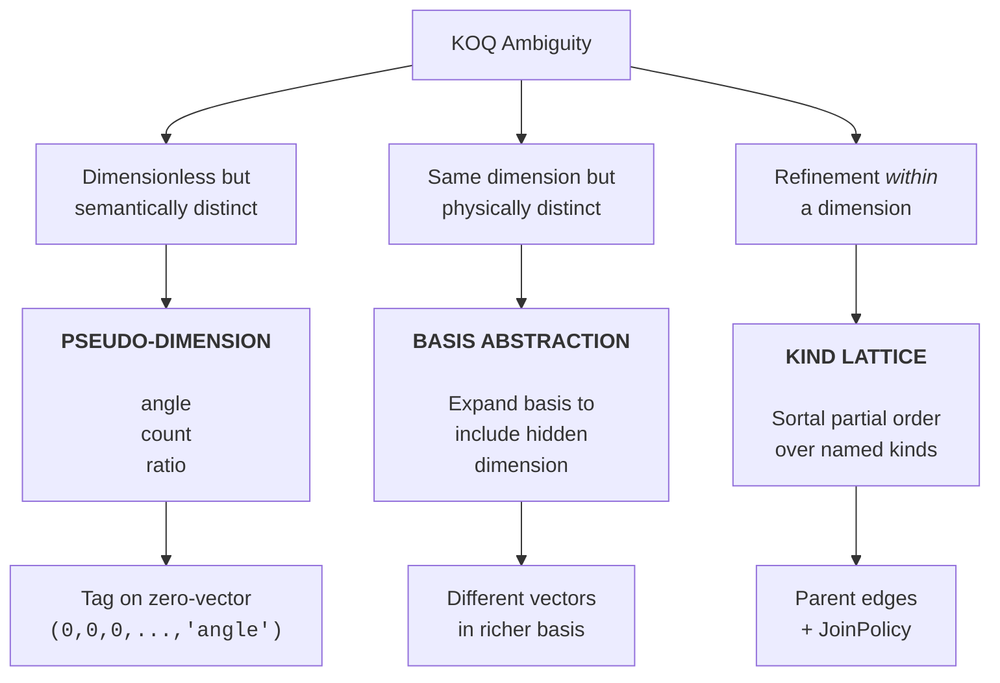

# The Kind-of-Quantity Problem

Core conceptual foundation for understanding dimensional ambiguity and how ucon addresses it.

---

## The Problem

When working with physical quantities, a fundamental limitation of dimensional
analysis becomes apparent: **units and dimensions do not uniquely identify
the kind of quantity being measured.**

### Examples of Ambiguity

| Unit | Possible Quantities |
|------|---------------------|
| `kg·m²·s⁻²` | Energy, Torque, Work, Heat |
| `s⁻¹` | Frequency, Angular velocity, Radioactive activity |
| `1` (dimensionless) | Angle, Refractive index, Efficiency, Count |

This is known as the **Kind-of-Quantity (KOQ) problem** in metrology literature.

### Why It Matters

- **Silent errors**: Adding energy to torque produces nonsense but passes dimensional checks
- **Ambiguous conversions**: `s⁻¹ → Hz` is valid for frequency but not for activity
- **Lost semantics**: Dimensionless quantities lose all physical meaning

---

## ucon's Three Solutions

ucon addresses KOQ through three complementary mechanisms:

1. **Pseudo-dimensions** — Semantic tags for quantities dimensionless within a basis
2. **Basis abstraction** — Coordinate transforms across dimensional systems
3. **Kind lattices** — Sortal refinements *within* a single dimension

The first two solutions build on the relationship between `BasisVector` and
`Dimension`. The third (introduced in v1.9.0 as an opt-in preview surface)
layers a partial order *on top of* dimensions to distinguish quantities that
share the same `BasisVector` but represent physically distinct kinds.

---

## BasisVector and Dimension

Before diving into solutions, it's important to understand how ucon represents
dimensions internally.

### BasisVector: The Coordinate Representation

A `BasisVector` is the raw numerical representation of a dimension—a tuple of
exponents over a basis. Think of it as coordinates in dimensional space:

```python
from ucon import BasisVector, SI
from fractions import Fraction

# Velocity = L/T = L¹·T⁻¹ in SI
# SI order: (T, L, M, I, Θ, J, N, B)
velocity_vector = BasisVector(SI, (
    Fraction(-1),  # T⁻¹
    Fraction(1),   # L¹
    Fraction(0),   # M⁰
    Fraction(0),   # I⁰
    Fraction(0),   # Θ⁰
    Fraction(0),   # J⁰
    Fraction(0),   # N⁰
    Fraction(0),   # B⁰
))

velocity_vector.is_dimensionless()  # False
```

`BasisVector` supports algebraic operations (multiplication, division, exponentiation)
that add, subtract, or scale exponents:

```python
# length_vec * length_vec = area_vec (exponents add)
# length_vec / time_vec = velocity_vec (exponents subtract)
```

### Dimension: The Named, Semantic Wrapper

A `Dimension` wraps a `BasisVector` with additional metadata:

- **name**: Human-readable identifier (e.g., "velocity", "energy")
- **symbol**: Short notation (e.g., "L", "T")
- **tag**: For pseudo-dimensions (e.g., "angle", "count")

```python
from ucon import Dimension

# Access predefined dimensions
Dimension.velocity.name    # "velocity"
Dimension.velocity.vector  # The underlying BasisVector

# Dimensions resolve from vectors automatically
from ucon import resolve_dimension
resolved = resolve_dimension(velocity_vector)
resolved == Dimension.velocity  # True
```

### The Key Relationship


```mermaid
flowchart LR
    subgraph BasisVector["BasisVector"]
        bv_basis["basis"]
        bv_components["components"]
        bv_algebra["algebra"]
    end

    subgraph Dimension["Dimension"]
        d_vector["vector"]
        d_name["name"]
        d_symbol["symbol"]
        d_tag["tag (pseudo)"]
    end

    Dimension -- "wraps" --> BasisVector

    BasisVector --> coords["(−1, 1, 0, 0, 0, 0, 0, 0)<br/><i>raw coordinates in dimensional space</i>"]
    Dimension --> semantic["Dimension(velocity)<br/><i>semantic identity for human reasoning</i>"]
```

**Why does this matter for KOQ?**

- `BasisVector` handles the algebra—it knows nothing about "torque" vs "energy"
- `Dimension` provides the semantic layer—it can distinguish quantities via names or tags
- The KOQ problem arises when the same `BasisVector` maps to multiple physical meanings
- ucon's solutions work by either:
  - Adding a **tag** to the `Dimension` (pseudo-dimensions)
  - Choosing a different **basis** so the `BasisVector` differs (basis abstraction)

---

## Solution 1: Pseudo-Dimensions

For quantities that are mathematically dimensionless but physically distinct,
ucon provides **pseudo-dimensions**:

```python
from ucon import Dimension, units

# These are all dimensionless (zero vector) but semantically isolated
Dimension.angle       # radians, degrees
Dimension.solid_angle # steradians
Dimension.ratio       # percent, ppm, ppb
Dimension.count       # discrete items

# Semantic isolation prevents nonsensical operations
angle = units.radian(3.14)
count = units.each(5)

# This raises TypeError — incompatible pseudo-dimensions
result = angle + count  # Error!

# But algebra within the same pseudo-dimension works
total_angle = units.radian(1.57) + units.radian(1.57)  # OK
```

### How Pseudo-Dimensions Work

| Aspect | Behavior |
|--------|----------|
| Algebraic | Zero vector — behaves as dimensionless in multiplication |
| Semantic | Tagged — prevents mixing incompatible types |
| Cancellation | `angle / angle = dimensionless` (not angle) |

### When to Use

- Angles (radian, degree, steradian)
- Counts of discrete items
- Ratios and proportions (percent, ppm)
- Any quantity dimensionless in all reasonable unit systems

---

## Solution 2: Basis Abstraction

The key insight is that **dimensional ambiguity is basis-dependent**. Two quantities
that share the same dimension in one basis may be distinguished in another.

### Example: Torque vs Energy

In standard SI, torque and energy are dimensionally identical:

| Quantity | SI Dimension | Problem |
|----------|--------------|---------|
| Energy | M·L²·T⁻² | Same as torque! |
| Torque | M·L²·T⁻² | Same as energy! |

But physically, torque = force × lever arm × **angle**. If we choose a basis where
angle is NOT dimensionless, the ambiguity resolves:

```python
from ucon import Basis, BasisComponent, BasisVector
from fractions import Fraction

# Define a basis where angle (θ) is a base dimension
MECHANICAL_WITH_ANGLE = Basis(
    "mechanical_angle",
    [
        BasisComponent("time", "T"),
        BasisComponent("length", "L"),
        BasisComponent("mass", "M"),
        BasisComponent("angle", "θ"),  # Angle as base dimension!
    ],
)

# In this basis:
# Energy = M·L²·T⁻²·θ⁰  (no angle dependence)
# Torque = M·L²·T⁻²·θ¹  (depends on angle!)

energy_vec = BasisVector(MECHANICAL_WITH_ANGLE, (
    Fraction(-2), Fraction(2), Fraction(1), Fraction(0)  # T⁻² L² M¹ θ⁰
))

torque_vec = BasisVector(MECHANICAL_WITH_ANGLE, (
    Fraction(-2), Fraction(2), Fraction(1), Fraction(1)  # T⁻² L² M¹ θ¹
))

energy_vec == torque_vec  # False! Now distinguishable
```

### Example: Gray (Gy) vs Sievert (Sv)

In radiation dosimetry, absorbed dose (Gy) and dose equivalent (Sv) have the
same SI dimension (m²·s⁻²) but measure different things:

- **Gray**: Physical energy absorbed per unit mass
- **Sievert**: Biological effect (weighted by radiation type)

A domain-specific basis can distinguish them:

```python
from ucon import Basis, BasisComponent, BasisVector
from fractions import Fraction

DOSIMETRY = Basis(
    "dosimetry",
    [
        BasisComponent("time", "T"),
        BasisComponent("length", "L"),
        BasisComponent("mass", "M"),
        BasisComponent("biological_weight", "Q"),  # Quality factor dimension
    ],
)

# Absorbed dose (Gy): L²·T⁻²·Q⁰
# Dose equivalent (Sv): L²·T⁻²·Q¹

absorbed_dose = BasisVector(DOSIMETRY, (
    Fraction(-2), Fraction(2), Fraction(0), Fraction(0)
))

dose_equivalent = BasisVector(DOSIMETRY, (
    Fraction(-2), Fraction(2), Fraction(0), Fraction(1)  # Q¹ factor!
))

# Now they're dimensionally distinct
absorbed_dose == dose_equivalent  # False
```

### Natural Units (Advanced)

For particle physics, where c = ℏ = k_B = 1, dimensions collapse further:

| Quantity | SI Dimension | Natural Units |
|----------|--------------|---------------|
| Velocity | L·T⁻¹ | E⁰ (dimensionless!) |
| Length | L | E⁻¹ |
| Mass | M | E |

```python
from ucon import SI, NATURAL, SI_TO_NATURAL, BasisVector
from fractions import Fraction

# Velocity becomes dimensionless in natural units
si_velocity = BasisVector(SI, (
    Fraction(-1), Fraction(1), Fraction(0), Fraction(0),
    Fraction(0), Fraction(0), Fraction(0), Fraction(0),
))

natural_velocity = SI_TO_NATURAL(si_velocity)
natural_velocity.is_dimensionless()  # True! (c = 1)
```

### When to Use Basis Abstraction

| Scenario | Basis Strategy |
|----------|----------------|
| Torque vs Energy | Add angle as base dimension |
| Gy vs Sv | Add biological weighting dimension |
| SI ↔ CGS | Standard basis transforms |
| Particle physics | Natural units (E only) |
| Electromagnetism | CGS-ESU (charge as base) |

---

## Solution 3: Kind Lattices

Some KOQ distinctions are too fine-grained to justify a basis split and too
structural to be captured by a pseudo-dimension tag. Two examples:

- **Absorbed dose** (Gy) and **equivalent dose** (Sv) share the SI dimension
  `L²·T⁻²`. We can pull them apart with a domain basis (Solution 2), but in
  many radiation-protection workflows the operator wants to keep working in
  ordinary SI and still have the type system know that "Sv" is a *refinement*
  of "Gy" — every Sv is a kind of absorbed dose, but not vice versa.
- **Kinetic energy** and **potential energy** share the dimension of energy.
  Adding them is meaningful (total mechanical energy), but mixing torque with
  kinetic energy is not — even though all three share `M·L²·T⁻²`.

A **kind lattice** captures this kind of refinement structure explicitly.
Each `Kind` is a *sortal* — a name and a parent — and the lattice records the
partial order: `kinetic_energy ≤ energy`, `gravitational_pe ≤ potential_energy
≤ energy`, and so on. The dimension is carried along, so a child kind cannot
refine across dimensions.

```python
from ucon.kinds import Kind, KindLattice, JoinPolicy
from ucon.dimension import LENGTH, MASS, TIME

ENERGY_DIM = (LENGTH ** 2) * MASS / (TIME ** 2)

energy = Kind("energy", dimension=ENERGY_DIM)
kinetic = Kind("kinetic_energy", dimension=ENERGY_DIM, parent=energy)
potential = Kind("potential_energy", dimension=ENERGY_DIM, parent=energy)
grav = Kind("gravitational_pe", dimension=ENERGY_DIM, parent=potential)
elastic = Kind("elastic_pe", dimension=ENERGY_DIM, parent=potential)

lat = KindLattice([energy, kinetic, potential, grav, elastic])

# Mixed potential-energy operations meet at their LCA.
ancestor, policy = lat.lca(grav, elastic)
ancestor.name      # "potential_energy"
policy             # JoinPolicy.LCA
```

### Join Policies

A `Kind` carries a `JoinPolicy` that determines what happens when two
distinct sibling kinds are combined (e.g., added):

| Policy | Meaning | Use case |
|--------|---------|----------|
| `LCA` (default) | Result takes the least-common-ancestor kind | Energies, doses, masses |
| `REFUSE` | Operation is rejected at the kind layer | `ratio`, `dimensionless`, anything where the union has no physical interpretation |

This is enough machinery to distinguish *refinement* (Sv ≤ Gy) from
*incommensurability* (ratio ⊥ dimensionless) without changing the underlying
dimensional algebra.

### Formula Registry

Kinds also unlock a small algebraic layer: a `FormulaRegistry` records
named relationships between input kinds and an output kind. The radiation
weighting equation `H = D · w_R` is a typical entry — given absorbed dose
and a weighting factor, the registry yields equivalent dose:

```python
from ucon.formulas import KindFormula, FormulaRegistry

D = Kind("absorbed_dose", dimension=ABSORBED_DOSE_DIM)
wR = Kind("radiation_weighting_factor", dimension=DIMENSIONLESS)
H = Kind("equivalent_dose", dimension=ABSORBED_DOSE_DIM)

f = KindFormula(
    name="radiation_weighting",
    expression="D * w_R",
    input_kinds={"D": D, "w_R": wR},
    output_kind=H,
    commutative=True,
)
reg = FormulaRegistry([f])
reg.lookup(D, wR).name  # "radiation_weighting"
reg.lookup(wR, D).name  # "radiation_weighting" (commutative)
```

#### Lookup Tiers

The registry's `resolve()` method checks four match tiers in strict
priority order — the first to produce a match wins:

| Tier | Name | Gate | Behaviour |
|------|------|------|-----------|
| 1 | **EXACT** | always on | Direct input-kind tuple match |
| 2 | **COMMUTATIVE** | `commutative=True` | Canonical sorted-key match (any arity) |
| 3 | **GENERALIZED** | `generalizes=True` + `lattice=` | Ancestor-walk at increasing L1 distance |
| 4 | **DIMENSIONAL** | `dimension_fallback=True` | Dimension-tuple match ignoring kind identity |

The generalized tier uses a bounded integer-composition algorithm: at each
L1 distance *d*, it enumerates all ways to distribute *d* parent-climbs
across *n* input positions. If exactly one formula matches at a given
distance, it wins. If more than one match at the same distance, an
`AmbiguousFormula` error is raised — the caller must disambiguate.

```python
result = reg.resolve(kinetic_energy, scale_factor, lattice=lat)
result.match_kind  # MatchKind.GENERALIZED
result.distance    # 1 (kinetic_energy → energy = 1 climb)
```

### Aspect Propagation

Kinds tell you *what* a quantity is; **aspects** tell you *something about*
a quantity — that it was reduced from many measurements, that it was
calibrated against a reference, that it represents a signal summary.
Aspects are covariant tags (strings) carried alongside a quantity,
orthogonal to kinds: two values with the same kind can differ in aspects,
and two values with different kinds can share aspects.

Aspects matter at two sites in the algebra:

1. **Multiplication (formula application)** — the formula's `aspect_rules`
   controls which operand aspects propagate to the output.
2. **Addition (lattice join)** — the `AspectJoinPolicy` chosen by the
   caller controls how aspects from two operands combine.

#### Formula Rules: CONSUME and CARRY

Each binding in a `KindFormula` can declare an `AspectRule`:

| Rule | Behaviour |
|------|-----------|
| `CARRY` (default) | The operand's aspects are unioned into the output |
| `CONSUME` | The operand's aspects are dropped |

Bindings not mentioned in `aspect_rules` default to `CARRY` — the
conservative choice is to preserve information; authors opt into dropping
it.


```mermaid
flowchart LR
    subgraph inputs ["Inputs"]
        D["D: absorbed_dose<br/><b>aspects:</b> signal_summary"]
        wR["w_R: weighting_factor<br/><b>aspects:</b> calibrated"]
    end

    subgraph formula ["Formula: H = D * w_R"]
        rule_D["D → CARRY"]
        rule_wR["w_R → CONSUME"]
    end

    subgraph output ["Output"]
        H["H: equivalent_dose<br/><b>aspects:</b> signal_summary"]
    end

    D --> rule_D --> H
    wR --> rule_wR
```

In code:

```python
from ucon.aspects import AspectRule, AspectSet
from ucon.formulas import KindFormula, FormulaRegistry

f = KindFormula(
    name="radiation_weighting",
    expression="D * w_R",
    input_kinds={"D": absorbed_dose, "w_R": weighting_factor},
    output_kind=equivalent_dose,
    aspect_rules={"w_R": AspectRule.CONSUME},  # D defaults to CARRY
)
reg = FormulaRegistry([f])

formula, out_kind, out_aspects, match_kind = reg.apply({
    "D":   (absorbed_dose,      AspectSet("signal_summary")),
    "w_R": (weighting_factor,   AspectSet("calibrated")),
})
# out_kind    == equivalent_dose
# out_aspects == frozenset({"signal_summary"})  — w_R's aspects consumed
# match_kind  == MatchKind.EXACT
```

#### Lattice Join: AspectJoinPolicy

When two quantities with different kinds are added, the kind lattice
computes the LCA. A separate, pure operation combines the aspect sets:

| Policy | Behaviour | Default |
|--------|-----------|---------|
| `INTERSECT` | Keep only aspects present on **both** sides | Yes |
| `UNION` | Keep every aspect from **either** side | No |

`INTERSECT` is the default because addition crosses kinds: the LCA result
is less specific than either operand, so unshared aspects cannot be
honestly attributed to the result.

```python
from ucon.aspects import join_aspects, AspectJoinPolicy

out = join_aspects(
    AspectSet("signal_summary", "calibrated"),
    AspectSet("signal_summary"),
)
# out == frozenset({"signal_summary"})   (INTERSECT default)

out = join_aspects(
    AspectSet("signal_summary", "calibrated"),
    AspectSet("signal_summary"),
    policy=AspectJoinPolicy.UNION,
)
# out == frozenset({"signal_summary", "calibrated"})
```

#### Status in v1.9.1

Aspects are an **opt-in preview surface**, like kinds:

- Not re-exported from the top-level `ucon` package — import from
  `ucon.aspects` directly.
- Not yet wired into `Number` arithmetic; aspect information is carried
  only by client code that chooses to participate.
- `FormulaRegistry.apply` is the single entry point that combines formula
  lookup with aspect projection.
- v2.0 binds aspects to `Number` alongside kinds.

### TOML Authoring

Both kinds and formulas can be declared in TOML and loaded with
`load_kinds_file` / `load_formulas_file`. The two sections are siblings and
can share a file:

```toml
[[kinds]]
name = "absorbed_dose"
dimension = "L^2/T^2"
aliases = ["D"]

[[kinds]]
name = "equivalent_dose"
dimension = "L^2/T^2"
parent = "absorbed_dose"
aliases = ["H"]

[[formulas]]
name = "radiation_weighting"
expression = "D * w_R"
output_kind = "equivalent_dose"
commutative = true

[formulas.inputs]
D = { kind = "absorbed_dose" }
w_R = { kind = "radiation_weighting_factor" }
```

### Status

Kinds, formulas, and aspects are an **opt-in preview surface**:

- Not re-exported from the top-level `ucon` package — import from
  `ucon.kinds`, `ucon.formulas`, `ucon.aspects`, and `ucon.parsing`
  directly.
- Not yet wired into `Number` arithmetic; `Kind` and aspect information is
  carried only by client code that chooses to participate.
- The `aspect_rules` field on `KindFormula` gained operational semantics
  in v1.9.1 (see [Aspect Propagation](#aspect-propagation) above).
- v1.9.2 completed lookup completeness: `resolve()` supports full n-ary
  commutative permutation, generalized ancestor-walk matching, and
  opt-in dimension-only fallback (see [Lookup Tiers](#lookup-tiers) above).
- v2.0 wires the lattice into `Number` so the type system can enforce
  refinement constraints automatically.

### When to Use a Kind Lattice

| Scenario | Why kinds fit |
|----------|---------------|
| Distinguishing refinements (Gy → Sv, energy → kinetic_energy) | Partial order is the natural model; basis splitting would be heavyweight |
| Locking down algebra at boundaries (no torque + energy, no ratio + dimensionless) | `REFUSE` policy at the lattice level is more precise than a tag |
| Driving formula lookup from declared inputs | `FormulaRegistry` indexes by `(Kind, …)` directly |
| Authoring domain knowledge in TOML | Kinds and formulas serialize cleanly alongside unit packages |

---

## Comparing the Three Approaches

| Aspect | Pseudo-Dimensions | Basis Abstraction | Kind Lattices |
|--------|-------------------|-------------------|---------------|
| **Problem solved** | Dimensionless quantities that differ semantically | Quantities with same dimension that differ physically | Refinements *within* a dimension (sortal structure) |
| **Mechanism** | Semantic tag on zero-vector | Choose a basis where dimensions differ | Partial order over named kinds |
| **Scope** | Works within any single basis | Requires defining/choosing appropriate basis | Works within any single dimension |
| **Examples** | angle vs count vs ratio | torque vs energy, Gy vs Sv | kinetic_energy ≤ energy, equivalent_dose ≤ absorbed_dose |
| **Declaration** | `Dimension.pseudo("tag")` | `Basis(name, components)` | `Kind(name, dimension, parent=...)` |
| **Trade-off** | Simple but limited to "truly" dimensionless | Powerful but requires domain modeling | Lightweight refinement, but opt-in (not yet wired to `Number`) |

---

## The Unified Picture

All three solutions preserve **kind-of-quantity information** that pure
dimensional analysis loses. The choice depends on the nature of the
ambiguity:


```mermaid
flowchart TB
    KOQ["KOQ Ambiguity"]

    KOQ --> dimensionless["Dimensionless but<br/>semantically distinct"]
    KOQ --> same_dim["Same dimension but<br/>physically distinct"]
    KOQ --> refinement["Refinement <i>within</i><br/>a dimension"]

    dimensionless --> pseudo["<b>PSEUDO-DIMENSION</b><br/><br/>angle<br/>count<br/>ratio"]
    same_dim --> basis["<b>BASIS ABSTRACTION</b><br/><br/>Expand basis to<br/>include hidden<br/>dimension"]
    refinement --> kind["<b>KIND LATTICE</b><br/><br/>Sortal partial order<br/>over named kinds"]

    pseudo --> tag["Tag on zero-vector<br/><code>(0,0,0,...,'angle')</code>"]
    basis --> vectors["Different vectors<br/>in richer basis"]
    kind --> parent["Parent edges<br/>+ JoinPolicy"]
```

**Key insight**: The SI's 7-dimensional basis is a pragmatic choice, not a
physical necessity. Some KOQ problems arise because the SI basis is too
coarse to distinguish certain quantities; others arise because the quantities
*do* share a dimension but stand in a refinement relation. ucon lets you:

1. **Add semantic tags** for quantities the SI treats as dimensionless
2. **Define richer bases** for quantities the SI conflates
3. **Declare a kind lattice** for quantities that share a dimension but
   refine one another

---

## Further Reading

- Hall, B.D. (2022). "Representing quantities and units in digital systems." *Measurement: Sensors*
- Hall, B.D. (2023). "Modelling expressions of physical quantities." *IC3K 2023*
- Hall, B.D. (2025). "Interpreting SI notation for units and dimensions." *Measurement: Sensors*
