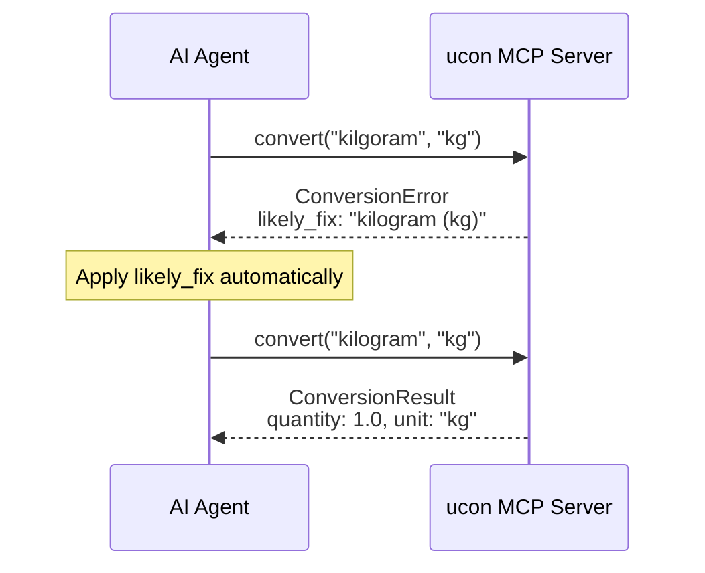
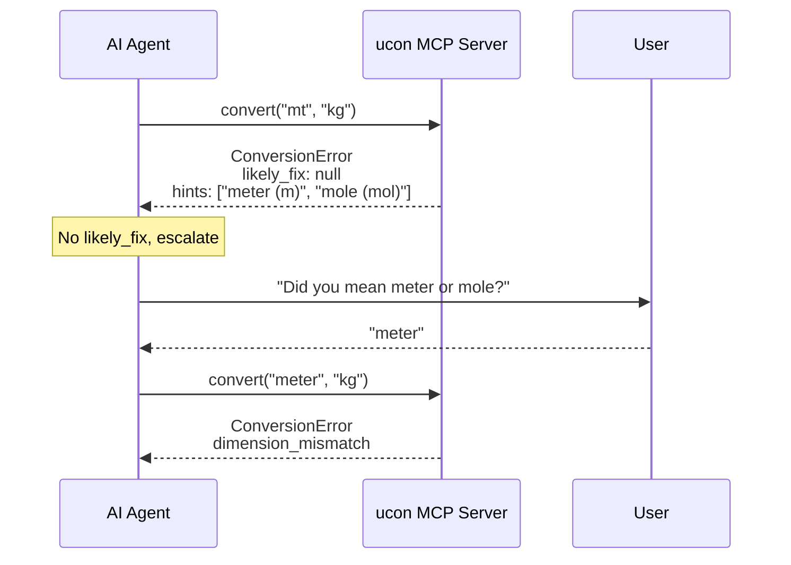

# Suggestions & Recovery

How ucon's MCP server helps AI agents self-correct errors.

---

## Overview

When MCP tools encounter errors, they return structured `ConversionError` responses instead of raw exceptions. These responses include:

- **`likely_fix`** — High-confidence mechanical correction (apply directly)
- **`hints`** — Lower-confidence suggestions (reason about or escalate)

This split enables agents to distinguish typo fixes from ambiguous situations requiring human judgment.

---

## ConversionError Schema

```python
class ConversionError(BaseModel):
    error: str           # Human-readable description
    error_type: str      # "unknown_unit", "dimension_mismatch", "no_conversion_path", "parse_error"
    parameter: str | None  # Which input caused the error
    step: int | None     # For compute(), which factor step failed
    got: str | None      # What was provided
    expected: str | None # What was expected
    likely_fix: str | None  # High-confidence fix
    hints: list[str]     # Lower-confidence suggestions
```

---

## Fuzzy Matching

### Algorithm

ucon uses `difflib.SequenceMatcher` with a tiered confidence system:

```python
from difflib import SequenceMatcher, get_close_matches

def _suggest_units(bad_name: str) -> tuple[str | None, list[str]]:
    corpus = list(_UNIT_REGISTRY.keys())
    matches = get_close_matches(bad_name.lower(), corpus, n=3, cutoff=0.6)

    if not matches:
        return None, []

    top_score = SequenceMatcher(None, bad_name.lower(), matches[0]).ratio()

    # Tier 1: High confidence (≥0.7) with clear gap → likely_fix
    if top_score >= 0.7:
        if len(matches) >= 2:
            second_score = similarity(bad_name.lower(), matches[1])
            if top_score - second_score >= 0.1:  # Clear winner
                return format_unit(matches[0]), [format_unit(m) for m in matches[1:]]
        else:
            return format_unit(matches[0]), []

    # Tier 2: Multiple close matches → hints only
    return None, [format_unit(m) for m in matches]
```

### Confidence Thresholds

| Score | Gap to Second | Result |
|-------|---------------|--------|
| ≥ 0.7 | ≥ 0.1 | `likely_fix` |
| ≥ 0.7 | < 0.1 | `hints` (ambiguous) |
| 0.6–0.7 | any | `hints` |
| < 0.6 | any | No suggestions |

### Why 0.7?

The threshold balances precision and recall:

- **Too low (0.5):** "meter" matches "mole" → false positives
- **Too high (0.9):** "kilgoram" doesn't match "kilogram" → missed corrections
- **0.7:** "kilgoram" → "kilogram" (0.86), but "mt" → nothing (too ambiguous)

---

## Error Types

### Unknown Unit

Triggered when `get_unit_by_name()` fails:

```python
convert(1, "kilgoram", "kg")
# → ConversionError(
#     error="Unknown unit: 'kilgoram'",
#     error_type="unknown_unit",
#     likely_fix="kilogram (kg)",
#     hints=["For scaled variants: km, mm (see list_scales)"]
# )
```

### Dimension Mismatch

Triggered when units have incompatible dimensions:

```python
convert(1, "kg", "m")
# → ConversionError(
#     error="Cannot convert 'kg' to 'm': mass is not compatible with length",
#     error_type="dimension_mismatch",
#     got="mass",
#     expected="mass",
#     hints=[
#       "kg is mass; m is length",
#       "Compatible mass units: kg, lb, g, oz",
#       "Use check_dimensions() to verify compatibility"
#     ]
# )
```

### No Conversion Path

Triggered for pseudo-dimension isolation or missing edges:

```python
convert(1, "radian", "percent")
# → ConversionError(
#     error="No conversion path from 'radian' to 'percent'",
#     error_type="no_conversion_path",
#     hints=[
#       "radian is angle; percent is ratio",
#       "angle and ratio are isolated pseudo-dimensions — they cannot interconvert",
#       "To express an angle as a fraction, compute angle/(2*pi) explicitly"
#     ]
# )
```

### Parse Error

Triggered for malformed unit expressions:

```python
convert(1, "W/(m²*K", "BTU/h")
# → ConversionError(
#     error="Cannot parse unit expression: 'W/(m²*K'",
#     error_type="parse_error",
#     hints=[
#       "Parse error: unbalanced parentheses",
#       "Check for unbalanced parentheses or invalid characters",
#       "Valid syntax: m/s, kg*m/s^2, W/(m²·K)"
#     ]
# )
```

---

## The Converging Validation Loop

MCP error responses enable a self-correction loop:



For ambiguous cases (no `likely_fix`):



---

## Garbage Rejection

High thresholds prevent nonsense suggestions:

```python
convert(1, "xyzzy", "kg")
# → ConversionError(
#     error="Unknown unit: 'xyzzy'",
#     error_type="unknown_unit",
#     likely_fix=None,  # No match above 0.6
#     hints=[
#       "No similar units found",
#       "Use list_units() to see all available units"
#     ]
# )
```

This is intentional. Low-confidence suggestions would lead agents to guess incorrectly, causing cascading errors.

---

## Compatible Unit Suggestions

For dimension mismatches, ucon suggests units that *would* work:

```python
def _get_compatible_units(dimension: Dimension, limit: int = 5) -> list[str]:
    """Find units with conversion paths for a given dimension."""
    graph = get_default_graph()
    if dimension not in graph._unit_edges:
        return []

    units = []
    for unit in graph._unit_edges[dimension]:
        if hasattr(unit, 'original'):  # Skip RebasedUnit
            continue
        label = unit.shorthand or unit.name
        if label not in units:
            units.append(label)
        if len(units) >= limit:
            break
    return units
```

This walks `ConversionGraph._unit_edges` rather than filtering by dimension alone, so only units with actual conversion paths are suggested.

---

## Step Localization

For `compute()` with multi-step factor chains, errors include the step index:

```python
compute(
    initial_value=100,
    initial_unit="kg",
    factors=[
        {"numerator": "lb", "denominator": "kg"},      # step 0
        {"numerator": "foo", "denominator": "lb"},     # step 1 ← error here
    ]
)
# → ConversionError(
#     error="Unknown unit: 'foo'",
#     step=1,  # Points to the failing factor
#     ...
# )
```

This enables agents to fix specific steps without revalidating the entire chain.

---

## Unit Format

Suggestions format units with their shorthand:

```python
def _format_unit_with_aliases(unit: Unit) -> str:
    if unit.shorthand and unit.shorthand != unit.name:
        return f"{unit.name} ({unit.shorthand})"
    return unit.name

# Examples:
# "kilogram (kg)"
# "meter (m)"
# "each (ea)"
```

Including the shorthand helps agents understand that `kg` and `kilogram` are the same unit.

---

## Implementation: `ucon/mcp/suggestions.py`

The suggestion logic is isolated in a dedicated module for:

1. **Testability** — Unit test fuzzy matching without MCP infrastructure
2. **Reusability** — Other interfaces (CLI, web) can use the same logic
3. **Maintainability** — Error formatting separate from tool dispatch

Key functions:

| Function | Purpose |
|----------|---------|
| `resolve_unit()` | Parse unit string, return structured error on failure |
| `build_unknown_unit_error()` | Fuzzy match suggestions |
| `build_dimension_mismatch_error()` | Compatible unit suggestions |
| `build_no_path_error()` | Pseudo-dimension isolation explanation |
| `build_parse_error()` | Syntax error guidance |
