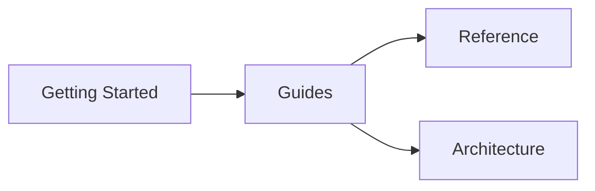

# Ticket: Public Documentation Scaffold with MkDocs

**Priority:** High
**Theme:** Developer Experience
**Version:** v0.7.x
**Status:** Ready
**Depends On:** None
**Blocks:** All documentation content work

---

## User Story

**As a** developer evaluating or adopting ucon,
**I want** public documentation at docs.ucon.dev with quickstart guides, API reference, and architectural context,
**So that** I can understand ucon's capabilities, integrate it correctly, and troubleshoot issues without reading source code.

**As a** contributor to ucon,
**I want** `make docs` and `make docs-serve` to build and preview documentation locally,
**So that** I can verify documentation changes before committing.

---

## Summary

Set up the MkDocs Material documentation scaffold so that `make docs` builds and `make docs-serve` runs a local dev server. This establishes the infrastructure for docs.ucon.dev content.

---

## Current State

**Already exists:**
- `pyproject.toml` has `docs` extra: `mkdocs-material`, `mkdocstrings[python]`
- `Makefile` has `docs` and `docs-serve` targets
- Handoff document: `docs/HANDOFF_docs-ucon-dev.md`
- Implementation plan: `docs/docs-ucon-dev-implementation-plan.md`

**Missing:**
- `mkdocs.yml` configuration file
- `docs/` directory structure with placeholder content
- Verification that build pipeline works end-to-end

---

## Acceptance Criteria

### Configuration
- [ ] `mkdocs.yml` at repo root with Material theme configuration
- [ ] Dark/light mode toggle
- [ ] Navigation structure matching implementation plan
- [ ] mkdocstrings plugin configured for Python
- [ ] Code highlighting with copy button
- [ ] Mermaid diagram support
- [ ] Material icons render (`:material-*:` syntax via `pymdownx.emoji` extension)

### Directory Structure
- [ ] `docs/index.md` — landing/redirect
- [ ] `docs/getting-started/` — why-ucon, quickstart, installation
- [ ] `docs/guides/` — MCP, Pydantic, config safety, factor-label, custom units
- [ ] `docs/guides/domain-walkthroughs/` — nursing-dosage (and future domains)
- [ ] `docs/reference/` — API, units, MCP tools, scales
- [ ] `docs/architecture/` — design principles, ConversionGraph, suggestions, Pint comparison

### Placeholder Content
- [ ] Each directory has `index.md` with title and brief description
- [ ] Leaf pages have `# Title` and `TODO: content` placeholder
- [ ] At least one page demonstrates mkdocstrings working (e.g., `reference/api.md` with `::: ucon.Number`)

### Build Verification
- [ ] `make docs` succeeds without errors
- [ ] `make docs-serve` starts server at localhost:8000
- [ ] Navigation renders correctly
- [ ] mkdocstrings pulls docstrings from source
- [ ] Mermaid diagrams render (add one test diagram)
- [ ] Material icons render as SVGs (not raw `:material-*:` text)

---

## mkdocs.yml Specification

```yaml
site_name: ucon
site_url: https://docs.ucon.dev
repo_url: https://github.com/withtwoemms/ucon
repo_name: withtwoemms/ucon

theme:
  name: material
  palette:
    - media: "(prefers-color-scheme: dark)"
      scheme: slate
      primary: deep purple
      accent: amber
      toggle:
        icon: material/brightness-7
        name: Light mode
    - media: "(prefers-color-scheme: light)"
      scheme: default
      primary: deep purple
      accent: amber
      toggle:
        icon: material/brightness-4
        name: Dark mode
  features:
    - navigation.sections
    - navigation.expand
    - navigation.indexes
    - navigation.tabs
    - content.code.copy
    - content.code.annotate
    - search.suggest
    - search.highlight
  icon:
    repo: fontawesome/brands/github

nav:
  - Getting Started:
    - getting-started/index.md
    - Why ucon: getting-started/why-ucon.md
    - Quickstart: getting-started/quickstart.md
    - Installation: getting-started/installation.md
  - Guides:
    - guides/index.md
    - MCP Server: guides/mcp-server.md
    - Pydantic Integration: guides/pydantic-integration.md
    - Config Safety: guides/dimensional-safety-config.md
    - Factor-Label Calculations: guides/factor-label-calculations.md
    - Custom Units & Graphs: guides/custom-units-and-graphs.md
    - Domain Walkthroughs:
      - guides/domain-walkthroughs/index.md
      - Nursing Dosage: guides/domain-walkthroughs/nursing-dosage.md
  - Reference:
    - reference/index.md
    - API: reference/api.md
    - Units & Dimensions: reference/units-and-dimensions.md
    - MCP Tools: reference/mcp-tools.md
    - Scales & Prefixes: reference/scales-and-prefixes.md
  - Architecture:
    - architecture/index.md
    - Design Principles: architecture/design-principles.md
    - ConversionGraph: architecture/conversion-graph.md
    - Suggestions & Recovery: architecture/suggestions-and-recovery.md
    - Comparison with Pint: architecture/comparison-with-pint.md

plugins:
  - search
  - mkdocstrings:
      handlers:
        python:
          options:
            show_source: true
            show_root_heading: true
            members_order: source

markdown_extensions:
  - pymdownx.highlight:
      anchor_linenums: true
  - pymdownx.superfences:
      custom_fences:
        - name: mermaid
          class: mermaid
          format: !!python/name:pymdownx.superfences.fence_code_format
  - pymdownx.tabbed:
      alternate_style: true
  - pymdownx.emoji:
      emoji_index: !!python/name:material.extensions.emoji.twemoji
      emoji_generator: !!python/name:material.extensions.emoji.to_svg
  - admonition
  - pymdownx.details
  - attr_list
  - md_in_html
  - tables
  - toc:
      permalink: true

extra:
  social:
    - icon: fontawesome/brands/github
      link: https://github.com/withtwoemms/ucon
```

---

## Directory Structure

```
docs/
  index.md
  getting-started/
    index.md
    why-ucon.md
    quickstart.md
    installation.md
  guides/
    index.md
    mcp-server.md
    pydantic-integration.md
    dimensional-safety-config.md
    factor-label-calculations.md
    custom-units-and-graphs.md
    domain-walkthroughs/
      index.md
      nursing-dosage.md
  reference/
    index.md
    api.md
    units-and-dimensions.md
    mcp-tools.md
    scales-and-prefixes.md
  architecture/
    index.md
    design-principles.md
    conversion-graph.md
    suggestions-and-recovery.md
    comparison-with-pint.md
mkdocs.yml
```

---

## Placeholder Template

For index pages:
```markdown
# Section Title

Brief description of this section.

- [Page 1](page1.md) — one-line description
- [Page 2](page2.md) — one-line description
```

For leaf pages:
```markdown
# Page Title

!!! note "Under Construction"
    This page is a placeholder. Content coming soon.

## Overview

TODO: Write overview.

## Example

TODO: Add code example.
```

---

## Test: mkdocstrings Working

`reference/api.md` should include:

```markdown
# API Reference

## Number

::: ucon.Number
    options:
      show_source: false
      members: false
```

Verify this renders the `Number` class docstring.

---

## Test: Mermaid Working

Add to `architecture/index.md`:

```markdown
## Documentation Structure


```

Verify the diagram renders.

---

## Deployment Note

This ticket covers the **scaffold in the ucon repo only**. Deployment to docs.ucon.dev via the ucon.dev repo (submodule pattern) is a separate task. See `docs/HANDOFF_docs-ucon-dev.md` for deployment architecture.

---

## Verification Commands

```bash
# Install docs dependencies
make install  # or: pip install -e '.[docs]'

# Build static site
make docs
# Output: site/

# Start dev server
make docs-serve
# Browse: http://127.0.0.1:8000
```

---

## Files to Create

| File | Type |
|------|------|
| `mkdocs.yml` | Configuration |
| `docs/index.md` | Landing |
| `docs/getting-started/index.md` | Section index |
| `docs/getting-started/why-ucon.md` | Placeholder |
| `docs/getting-started/quickstart.md` | Placeholder |
| `docs/getting-started/installation.md` | Placeholder |
| `docs/guides/index.md` | Section index |
| `docs/guides/mcp-server.md` | Placeholder |
| `docs/guides/pydantic-integration.md` | Placeholder |
| `docs/guides/dimensional-safety-config.md` | Placeholder |
| `docs/guides/factor-label-calculations.md` | Placeholder |
| `docs/guides/custom-units-and-graphs.md` | Placeholder |
| `docs/guides/domain-walkthroughs/index.md` | Section index |
| `docs/guides/domain-walkthroughs/nursing-dosage.md` | Placeholder |
| `docs/reference/index.md` | Section index |
| `docs/reference/api.md` | mkdocstrings test |
| `docs/reference/units-and-dimensions.md` | Placeholder |
| `docs/reference/mcp-tools.md` | Placeholder |
| `docs/reference/scales-and-prefixes.md` | Placeholder |
| `docs/architecture/index.md` | Section index + mermaid test |
| `docs/architecture/design-principles.md` | Placeholder |
| `docs/architecture/conversion-graph.md` | Placeholder |
| `docs/architecture/suggestions-and-recovery.md` | Placeholder |
| `docs/architecture/comparison-with-pint.md` | Placeholder |

**Total: 1 config + 21 markdown files**

---

## Closure Note (2026-07-12)

**Closed: done.** `mkdocs.yml` exists at repo root; `docs/getting-started/`,
`docs/guides/`, `docs/reference/`, `docs/architecture/` are populated with
real content (not placeholders), including pages beyond this ticket's scope
(kind-of-quantity, dual-graph architecture, migrating-to-v2). `make docs` /
`make docs-serve` targets are live in the Makefile.
